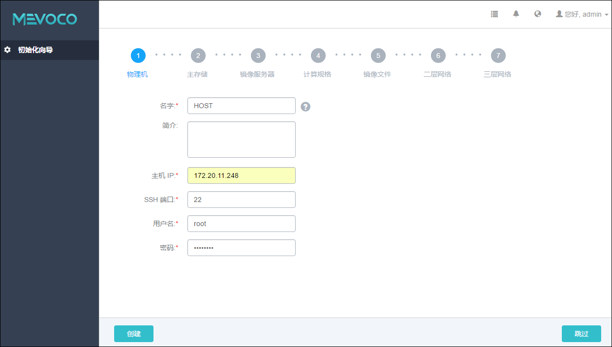

# 5.1 添加物理机（计算节点）


###### 图5-1 添加物理机界面
计算节点是云计算平台里的核心资产，云主机将会运行在计算节点之上。

添加计算节点具体步骤：

1. 输入物理机的名字，如图5-1所示。建议使用易区分之名字，例如，Host-Test-1。名字可以为中文，不建议使用容易重复的名称。点击名字输入框后边的问号，会提示添加物理机的帮助。

2. 输入物理机的简介，可简述Host相关信息进行备注。可以使用中文，也可留空不填。

3. 输入物理机的IP地址，输入格式为xxx.xxx.xxx.xxx 例如，图示的172.20.11.248。在生产环境中，建议用户采用管理和公有网络分离的方案。也就是管理节点和计算节点采用独立的网络和IP。
> 例如，使用eth0连接一套管理网络，系统通过管理网络与各个计算节点通讯；使用eth1连接另外一套公有网络，可以通过顶层汇聚交换机与外界互联互通。使用管理网络和公有网络分离的方案，可以最大限度的保障系统安全，以及保障足够的网络带宽供管理网络使用。

4. 输入物理机的SSH端口，默认为22，如果此物理机没有配置SSH端口，则可按照默认配置的22端口使用。

5. 输入物理机的用户名，默认为root用户，也可输入普通用户。如果此物理机没有添加普通用户，则可按照默认的root用户使用。普通用户要求拥有sudo权限。建议在创建普通用户时，使用adduser命令。创建普通用户及修改用户sudo权限可参考以下样例：
```
[root@localhost ~]# adduser mevoco
#创建一个名为mevoco的普通用户
[root@localhost ~]#echo “mevoco    ALL=(ALL)    NOPASSWD: ALL”>>/etc/sudoers
#授权用户拥有sudo权限
```
6. 输入物理机对应的用户密码，输入密码时请注意大小写。

7. 点击创建按钮，系统会调用后台作业来配置Host。配置过程可能持续几分钟。若安装出错，则会提示相应的错误信息。

8. 若进行引导设置后，再添加域内同一集群的其他主机，则对应主机需安装相同的CentOS 系统。SSH端口、用户名、密码则无须相同。

注意：添加Host主机错误，请参考[21.3.1](/exception/host.md) 添加物理机异常处理。
