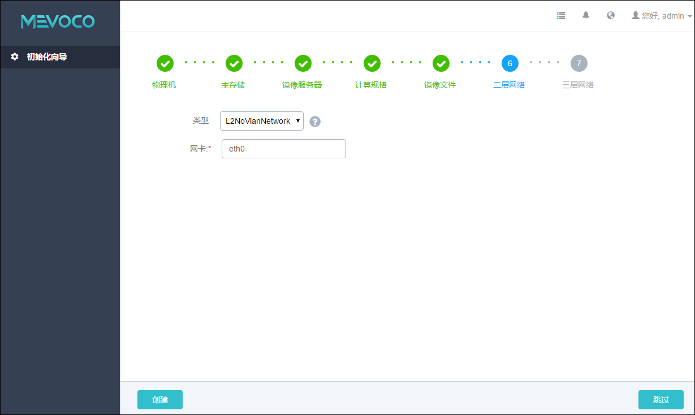
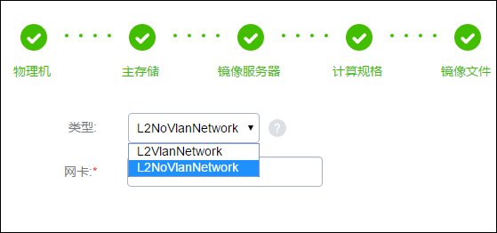

# 5.6 添加二层网络

在添加云主机镜像后，Wizard将引导进入计算节点网络配置界面，如图5-6-1所示。在生产环境中，建议用户采用管理和公有网络分离的方案。假设用户的计算节点网络设备名分别为eth0和eth1，如果之前添加计算节点时使用的IP地址是网络设备eth0的，那么在添加公有网络二层网络设备的时候可以使用eth1。

###### 图5-6-1 选择L2NoVlanNetwork界面

配置二层网络具体步骤：
  
1.在类型的下拉可选框，若不打算使用Vlan网络，则选择L2NoVlanNetwork。若需要系统帮助配置Vlan网络，则需选择L2VlanNetwork，如图5-6-2所示。当选择Vlan网络而且存在多台计算节点时，连接计算节点的交换机需要正确配置Vlan。点击类型后边的问号，会提示添加二层网络的帮助。

**注意：**当交换机接入口配置为Access模式时，用户需设置L2NoVlanNetwork

2.在网卡输入框输入对应计算节点的物理设备，例如：eth0

3.点击创建按钮，创建二层网络。

###### 图5-6-2 选择L2VlanNetwork界面

* 注意：添加Host节点网络配置错误，请参考[添加计算节点网络配置异常处理](/exception/l2.md)。

