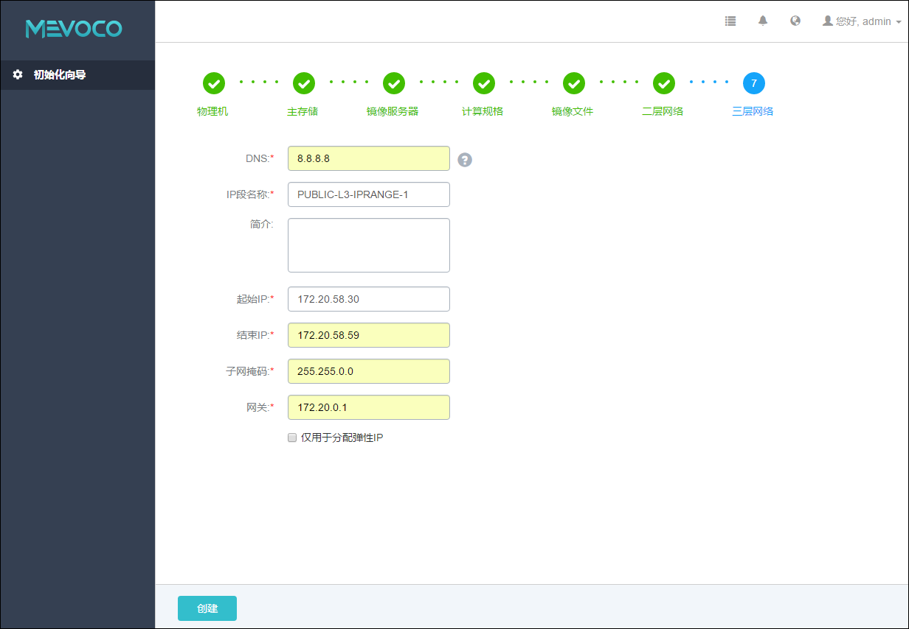

# 5.7 添加三层网络

在添加计算节点网络配置后，Wizard将引导进入三层网络配置界面，如图5-7所示。

系统初始化默认采用扁平网络模式，三层网络的IP地址范围可用于云主机的IP地址分配。

网关输入框下面的“仅用于分配弹性IP”选项，如果勾选，则代表此网络的IP地址范围只能用于弹性IP地址的分配，不能用于云主机的IP地址分配。

* 注意：请慎重勾选此项，对弹性IP不熟悉的用户，不建议勾选此项。

###### 图5-7 三层网络配置界面 

配置三层网络具体步骤：

1. 输入DNS地址，参考图示为8.8.8.8（谷歌DNS），也可指定114.114.114.114（国内电信114DNS）、210.22.84.3（国内联通DNS）、223.5.5.5（阿里DNS）、或其他指定DNS地址。点击DNS后边的问号，会提示添加三层网络的帮助。

2. 输入IP 段名称，用于标识三层网络的IP段名称。

3. 输入三层网络相关简介，可简述三层网络相关信息进行备注。可留空不填。

4. 输入起始IP，输入格式为xxx.xxx.xxx.xxx，例如：172.20.58.0，请确保此IP地址有效。

5. 输入结束IP，输入格式为xxx.xxx.xxx.xxx，例如：172.20.58.19，请确保此IP地址有效，且保证起止IP范围内地址均可用（不包括网关地址）。

6. 输入此IP段内有效子网掩码，输入格式为xxx.xxx.xxx.xxx，例如：255.255.0.0

7. 输入网内有效网关地址，输入格式为xxx.xxx.xxx.xxx，例如：172.20.0.1

8. 点击创建按钮，系统会配置相应的三层网络。

** 注意：**添加三层网络配置错误，请参考[21.3.7](/exception/l3.md) 添加三层网络配置异常处理。

