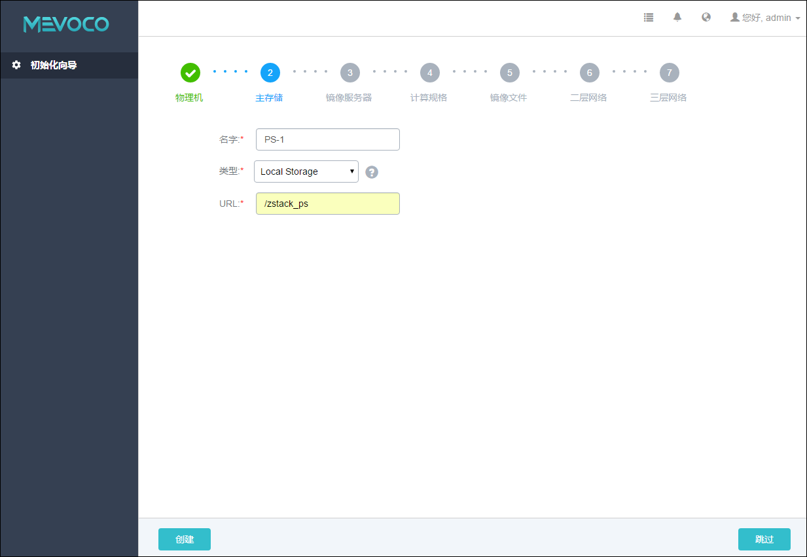

# 5.2.1 本地存储

如果采用了本地存储，那么所有的物理机都会使用相同的目录进行配置。

添加本地存储具体步骤，如图5-2-2所示：

1. 输入主存储的名字。

2. 选择主存储的类型为 Local Storage。默认选择即为此类型。

3. 输入本地存储的路径，可根据提示直接输入/zstack_ps，也可选择其他目录。需提前配置好大容量存储给此目录，以防止主存储空间资源不足。

4. 点击创建按钮，根据输入的路径，系统会配置物理机对应的目录作为主存储的路径。

###### 图5-2-2 添加本地存储界面 

