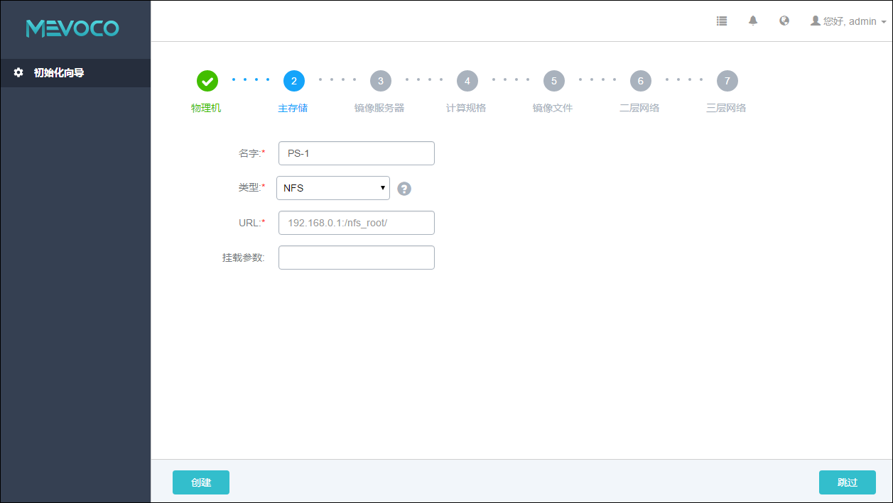

# 5.2.2 NFS主存储

如果采用了NFS，那么系统会在所有的物理机上自动挂载相同的NFS共享目录作为主存储。NFS Server的目录需提供读写权限。

添加NFS存储具体步骤，如图5-2-3所示：

1. 输入主存储的名字。

2. 选择主存储的类型为 NFS。

3. 输入NFS Server的共享目录，输入格式为：NFS_Server_IP:/NFS_Share_folder。可根据提示输入类似的192.168.0.1/nfs_root目录。其中192.168.0.1 为NFS 服务器的IP地址， /nfs_root是NFS服务器上可被挂载的目录。
> 如果选择NFS，请提前在NFS Server端设置相应目录的访问权限。为保证在NFS Server端的安全控制，建议配置相应安全规则，进行访问控制。用户可以提前在NFS Server端通过“showmount -e”命令检查NFS Server已共享的目录。

4. 输入NFS存储挂载的参数，每个参数以逗号隔开。例如，输入nfsvers=3,sec=sys,tcp,intr,timeo=5，表示NFS Server端的版本为3，采用标准的unix验证机制，采用tcp作为传输协议，允许通知中断一个nfs调用，设置超时时间为0.5秒（5/10）. NFS的mount参数可以参考mount的 ‘-o’ 选项里的内容。此选项为可选项，可留空不填。可根据常用的客户端mount命令参数进行设置。如果设置的参数与NFS Server端冲突，则以Server端为准。注意：此参数如果填写错误，可能导致mount失败。

5. 点击创建按钮，系统会配置物理机使用此NFS目录作为主存储。

###### 图5-2-3 添加NFS主存储界面

