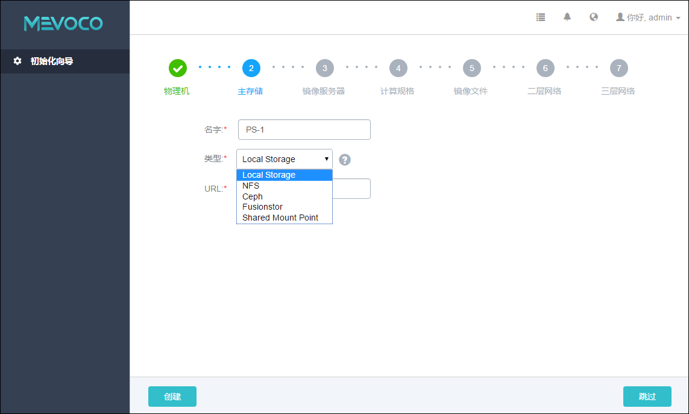

# 5.2 添加主存储

主存储主要用来存储云主机的磁盘文件。

在系统中，主存储的支持类型分为两大类，如图5-2-1所示，

第一类：本地存储Local Storage，使用各物理机的硬盘进行存储；

第二类：网络存储，又细分为NFS、Ceph、Fusionstor和Shared Mount Point几种类型。

NFS即为网络文件系统的存储方式。

Ceph采用了分布式块存储方式。

Fusionstor采用了华云网际提供的分布式块存储方式。

Shared Mount Point支持常用的分布式文件系统提供的网络共享存储， 支持的常见类型有MooseFS，GlusterFS，OCFS2，GFS2等。

添加主存储时，点击类型输入框后边的问号，会提示添加主存储的帮助。

###### 图5-2-1 添加主存储可选类型 

注意：添加主存储错误，请参考[21.3.2](/exception/ps.md) 添加主存储异常处理。

