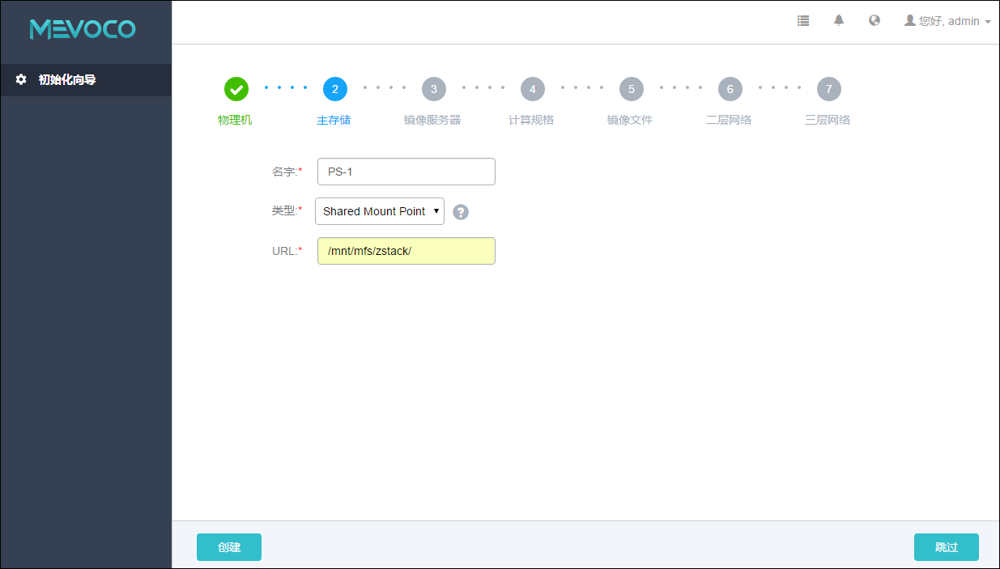

# 5.2.5 Shared Mount Point

Shared Mount Point提供了对MooseFS，GlusterFS，OCFS2，GFS2等可以提供共享文件系统存储的支持。

添加过程与本地存储类似，用户只需提供物理机挂载的本地目录，即可完成对各种分布式文件系统的对接。

选择使用Shared Mount Point，用户需要提前配置好相应的分布式文件系统。并且根据不同存储系统的客户端配置，预先在每台物理机上把共享文件系统挂载在相同的文件路径。

下面以MooseFS为例来配置主存储，假如MooseFS的master Server

IP地址为172.20.12.19。用户需要下载并安装MooseFS的客户端工具mfsmount。并且创建相应目录作为mount节点。

例如，创建/mnt/mfs作为挂载点，使用mfsmount命令挂载MooseFS系统。用户也可以根据需要使用mfssetgoal命令设置相应的文件副本保存数量。
```
[root@localhost ~]#mkdir /mnt/mfs 
[root@localhost ~]#mfsmount /mnt/mfs -H 172.20.12.19
[root@localhost ~]#mkdir /mnt/mfs/zstack
[root@localhost ~]#mfssetgoal -r 2 /mnt/mfs/zstack/
#以上命令为将 /mnt/mfs/zstack/目录的文件在远端的172.20.12.19 MooseFS的存储服务器保留两份拷贝
```
添加Shared Mount Point存储具体步骤，如图5-2-8所示：

1. 输入主存储的名字。

2. 选择主存储的类型为 Shared Mount Point。

3. 输入物理机已挂载的共享存储目录。例如，已经配置的/mnt/mfs/zstack目录。

4. 点击创建按钮，系统会自动配置主存储。
 

###### 图5-2-8 添加Shared Mount Point主存储界面

