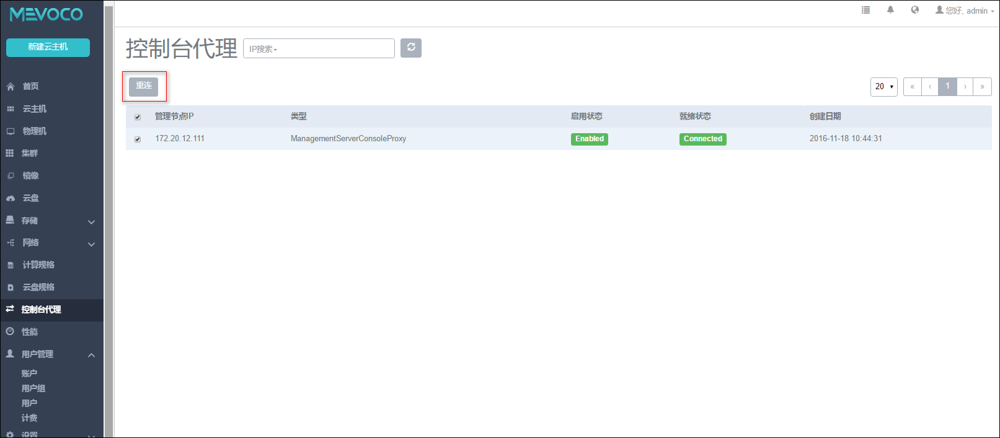

# 控制台代理异常
当出现如下错误提示时，

```
"description": "Cannot do an IO operation(e.g. network IO error, file IO error)",
"details": "I/O error on POST request for \"http://127.0.0.1:7758/console/establish\":Connect to 127.0.0.1:7758 [/127.0.0.1] failed: Connection refused; nested exception is org.apache.http.conn.HttpHostConnectException: Connect to 127.0.0.1:7758 [/127.0.0.1] failed: Connection refused","$$hashKey": "object:1344" 
```

需要删除掉/var/lib/zstack/pickledb/下面的consoleProxy文件

执行如下命令：
`rm -f /var/lib/zstack/pickledb/*`



###### 图22-6-1 重连控制台代理
