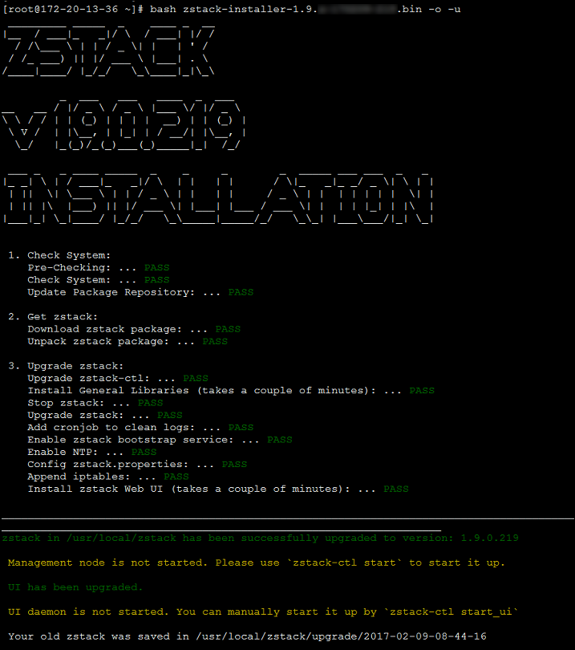

# 3.3 多节点安装

如果用户希望搭建一个高可用的产品级云环境，那么可以部署多个管理节点以保证管理节点的高可用。 如有对数据库和消息总线有高可用的需求，可参考Mevoco 高可用集群快速配置进行配置。

用户通过[3.1](/install/offline-install.md)或者[3.2](/install/online-install.md)已经安装完成一个管理节点，使用`zstack-ctl add_multi_management`命令安装。使用方法如下：

`zstack-ctl add_multi_management --host-list root:passwd1@host1_ip root:passwd2@host2_ip`

> 例如 zstack-ctl add_multi_management --host-list root:password@172.20.12.47 root:password@172.20.13.216

如图3-3-1所示,172.20.14.154为第一个管理节点，使用改命令添加172.20.12.47和172.20.13.216两个管理节点。

安装完毕后，Mevoco会使用这三台主机作为管理节点同时提供服务，任一管理节点服务中断，不影响其他管理节点的控制服务。

注意：此时Mysql、Rabbitmq的服务依然存在在第一台管理节点上。如有需求，可以将其分别配置。

###### 图3-3-1 Mevoco 多管理节点安装界面
