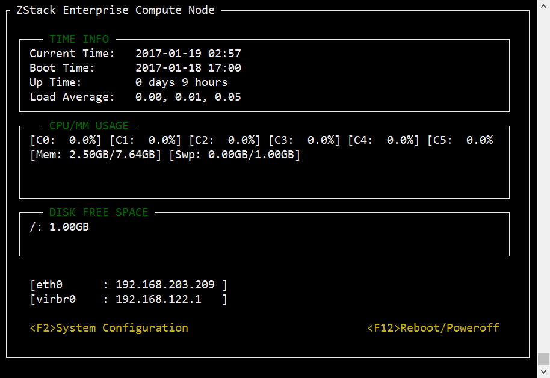
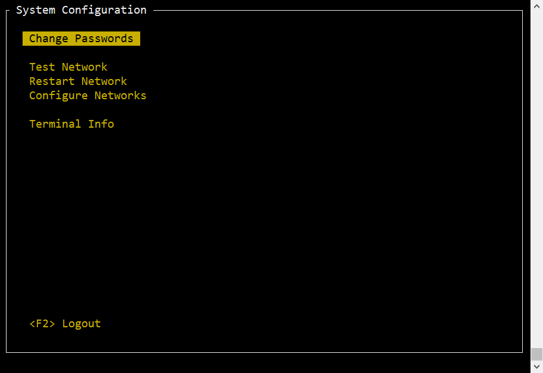

# 3.2 ZStack计算节点

如果用户选择计算节点安装模式，重启后会自动安装ZStack企业版的计算节点。安装完成后将自动进入TUI。

**注意：**部分场景下，需要all in one 的模式来搭建ZStack，这时应选用ZStack管理节点模式安装。

### 计算节点TUI

计算节点的TUI的主界面如图3-2-1所示。

###### 图3-2-1 计算节点主界面

计算节点的TUI拥有管理节点TUI的部分功能，因此计算节点TUI基本上就是精简版的管理节点TUI，使用方法与[ZStack管理节点](/install/mn-node.md)相同。

###### 图3-2-2 计算节点配置界面

