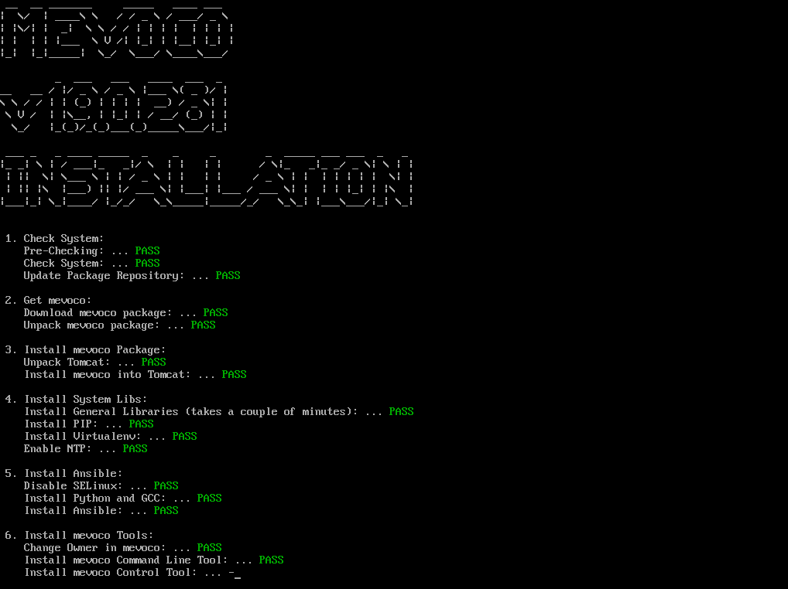
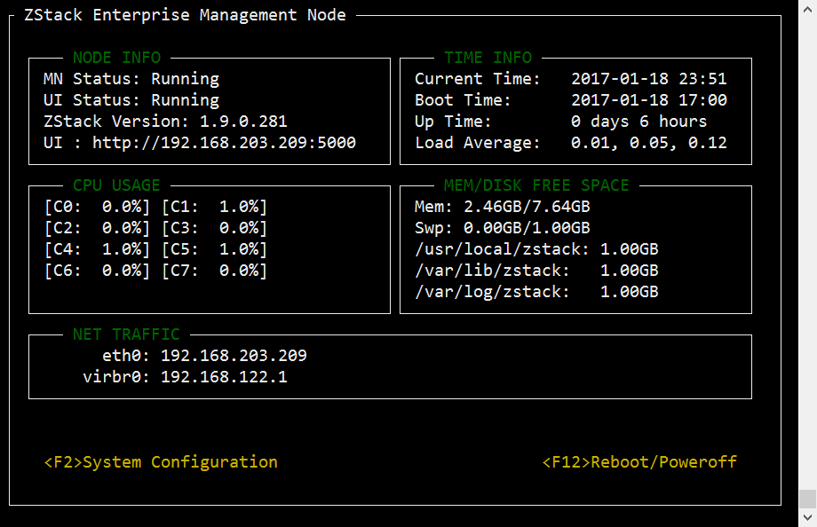

# 3.1 离线安装Mevoco

如果用户的内网无法访问官方yum源，并打算快速部署Mevoco，可采用ZStack定制版CentOS 7.2 ISO安装系统，此系统可实现Mevoco完全离线安装。

用户需提前准备好已安装了ZStack定制版Centos 7.2的物理机器，将此机器作为待安装Mevoco的管理节点。

ZStack定制版Centos 7.2的root密码为：password

离线安装步骤如下：

1. 下载Mevoco离线安装包到管理节点的任意目录（假如安装包名称为mevoco-installer.bin）。

2. 在此目录下执行“bash mevoco-installer.bin -o” 进行离线安装Mevoco，如图3-1-1所示。 “-o”代表采用离线安装，无须使用外部yum源。

3. 在安装Mevoco前，如果用户已经配置了MySQL数据库，并设置了数据库的root用户密码，请在安装时使用参数：“-P MYSQL_ROOT_PASSWORD”。如果用户没有预先设置MySQL root 用户密码，为了安全考虑，Mevoco安装程序将会主动设置一个root用户密码，具体的密码可以从安装完成后的屏幕输出获得。用户可以根据屏幕输出的提示来修改数据库root用户密码。如果用户有多网络，用户可以指定特定网络来安装，例如bash mevoco-installer.bin -o -I eth0 或者bash mevoco-installer.bin -o -I 192.168.0.1分半代表使用eth0的网卡或192.168.0.1的网络进行离线安装

4. 安装成功后，安装程序会提示相关可访问的URL，以进行Mevoco系统Web界面管理，例如: http://172.20.11.248:5000 。

5. 安装完毕的界面如图3-1-2所示。请仔细阅读安装完成后的屏幕的输出以获取更多信息。

**注意：**如下图所示，Mevoco安装完成后会自动安装nfs服务和http服务，分别为主存储和镜像服务器的测试目录。**请勿将生产环境的主存储和镜像备份目录放在这两个目录**。安装过程中遇到的异常，请参考18.1.1安装异常处理。

###### 图3-1-1 Mevoco安装界面

###### 图3-1-2 Mevoco安装完毕界面

