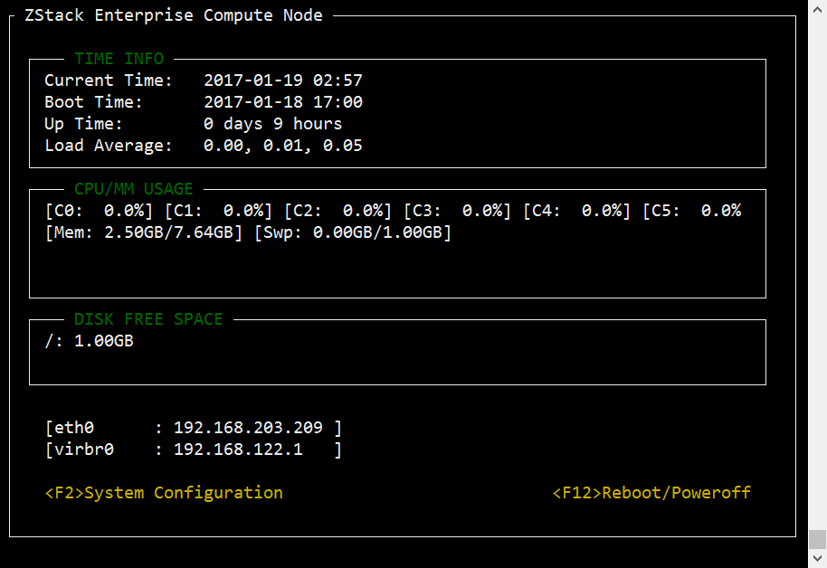

# 3.2 在线安装Mevoco
如果用户使用CentOS官方ISO安装了相应的 Centos7.2操作系统，并需使用外部的Yum源来安装相应的软件包，则需在线安装。

在线安装步骤如下：

1. 下载Mevoco离线安装包到任意目录（假如安装包名称为mevoco-installer.bin）。

2. 在此目录下执行“bash mevoco-installer.bin -R aliyun”进行安装Mevoco，如图3-2-1所示。（在安装过程中，安装程序会从yum源安装系统依赖库。中国大陆地区用户，建议选择采用阿里云或163的yum源。如果采用aliyun的yum源，请添加参数‘-R aliyun’；如果选择163的yum源，请添加参数‘-R 163’。）

3. 如果用户的网络访问CentOS官方Yum源的速度很快，可不带任何参数，直接执行“bash mevoco-installer.bin”进行安装。

4. 其他注意事项请参考[3.1](/install/offline-install.md)离线安装Mevoco。

###### 图3-2-1 Mevoco 在线安装界面
