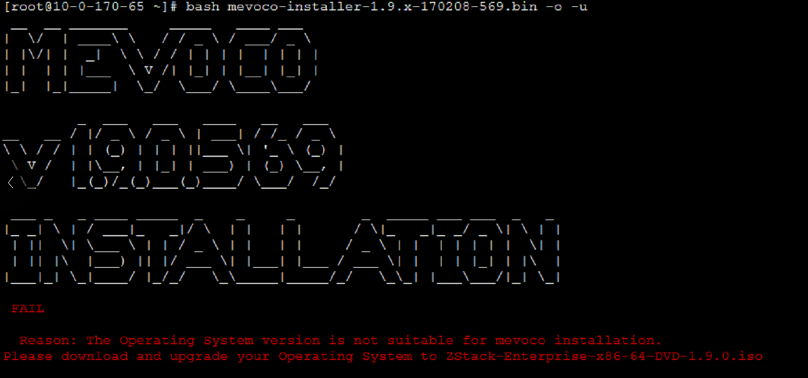
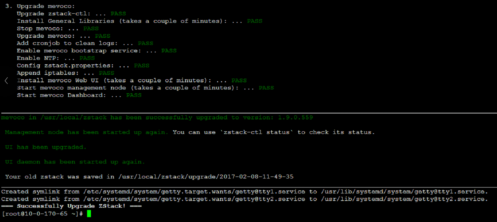

# 升级ZStack

从ZStack旧版本的环境中升级到新版本的ZStack会出现如下提示，属于正常现象。如图3-5-1所示。这是由于缺少升级新版本所必须的安装包，系统会给出这样的提示。

###### 图3-5-1 升级失败提示

在官网上下载最新版的ISO和升级脚本至/opt目录下,例如`ZStack-Enterprise-x86_64-DVD-1.9.0.iso`和`zstack-upgrade`。
> **下载地址如下**：
[http://www.mevoco.com/downloads/scripts/zstack-upgrade](http://www.mevoco.com/downloads/scripts/zstack-upgrade)
[http://download.zstack.org/ISO/ZStack-Enterprise-x86_64-DVD-1.9.0.iso](http://download.zstack.org/ISO/ZStack-Enterprise-x86_64-DVD-1.9.0.iso)

使用命令`bash zstack-upgrade ZStack-Enterprise-x86_64-DVD-1.9.0.iso`

###### 图3-5-2 升级成功

如果使用-r参数，表示只升级repo。环境升级完成后，可以自定义升级参数，参考[安装命令参数教程](http://www.mevoco.com/downloads/mevoco/documents/PD1012-Mevoco-bash-parameters.pdf)。

使用命令`bash zstack-upgrade -r ZStack-Enterprise-x86_64-DVD-1.9.0.iso `

###### 图3-5-3 升级ISO环境

