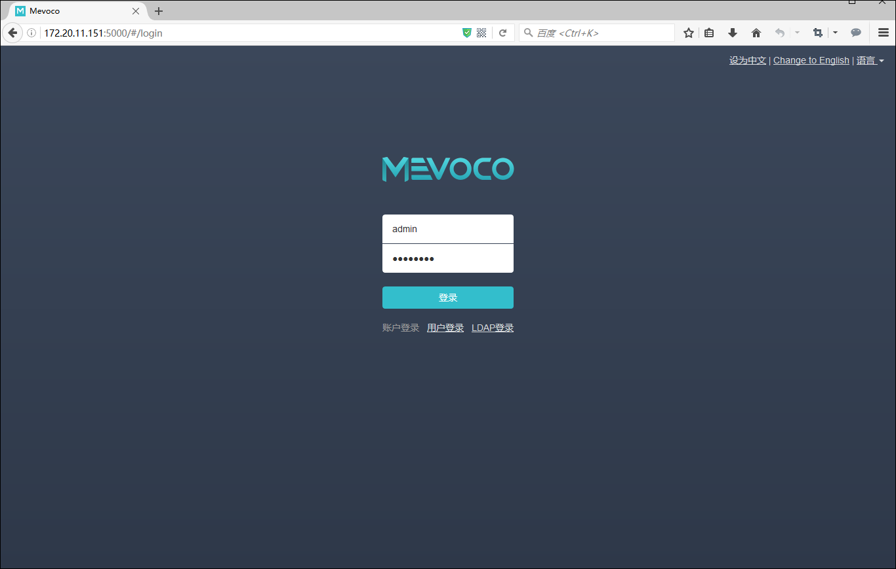

# 4 系统登录

###### 图4-1 UI登录界面

1. 输入相应的URL地址，例如输入 http://172.20.11.248:5000 ，打开UI管理界面，如图4-1所示（建议使用Chrome或Firefox浏览，图示为Chrome浏览器）

2. 系统登录方式分为三种，账户登录、用户登录和LDAP登录

3. 系统首次登录时，默认账户名：admin 默认初始密码：password

4. 点击登录即可登入系统

5. 首次登录成功后，可以在右上角的admin账户的按钮里更改密码

6. 登录时效为2小时，超时需重新登录。会话超时时间可以在主界面的设置的基础设置中配置

7. 通过点击语言按钮，即可切换UI界面语言，支持简体中文/英语/繁体中文

8. 通过点击退出按钮，即可退出系统 UI管理界面

* 注意：系统登录过程中遇到的异常，请参考[登录异常处理](/exception/login.md)
