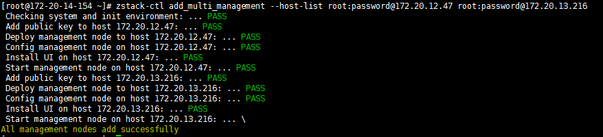

# 23.1 安装多个管理节点

### 自动安装

如果用户希望搭建一个高可用的产品级云环境，那么可以部署多个管理节点以保证管理节点的高可用。 

用户通过[安装部署ZStack](/install/README.md)已经安装完成一个管理节点，使用`zstack-ctl add_multi_management`命令安装。使用方法如下：

`zstack-ctl add_multi_management --host-list root:passwd1@host1_ip root:passwd2@host2_ip`

> 例如 zstack-ctl add\_multi\_management --host-list root:password@172.20.12.47 root:password@172.20.13.216

如图23-1-1所示,172.20.14.154为第一个管理节点，使用改命令添加172.20.12.47和172.20.13.216两个管理节点。

安装完毕后，系统会使用这三台主机作为管理节点同时提供服务，任一管理节点服务中断，不影响其他管理节点的控制服务。

注意：此时Mysql、Rabbitmq的服务依然存在在第一台管理节点上。如有需求，可以将其分别配置。



###### 图23-1-1 系统 多管理节点安装界面


### 手动安装

当管理大量物理机的时候，为了提高可用性，用户可以安装多个系统管理节点。多个系统管理节点之间关系平等，相互支撑。用户可以使用如下的方法安装：

`zstack-ctl install_management_node --host=ip_of_machine_to_install_node_2 --yum=alibase,aliepel`

当新节点成功安装后，请在新节点上配置新管理节点的IP地址：

```
zstack-ctl configure management.server.ip=ip_of_management_node2
zstack-ctl save_config
```

可以重复这一步来安装更多的管理节点。如果启动了多个管理节点，在批量创建云主机时，需要修改安装了mysql的管理节点的配置文件/etc/my.conf，将其中的最大连接数修改为适合的值，来增加可接受的最大并发数量。假如有三个管理节点，启动一百个云主机，最大并发数量至少需高于300，下例设置为500，可作为参考：

```
vim /etc/my.conf
max_connections = 500
```

如果用户购买了系统使用授权，请联系销售厂商给每一个管理节点单独安装一个授权协议。

### 多管理节点自动升级

ZStack一条命令即可完成多节点的升级：

```
zstack-ctl upgrade_multi_management_node --installer-bin zstack-installer.bin
```


