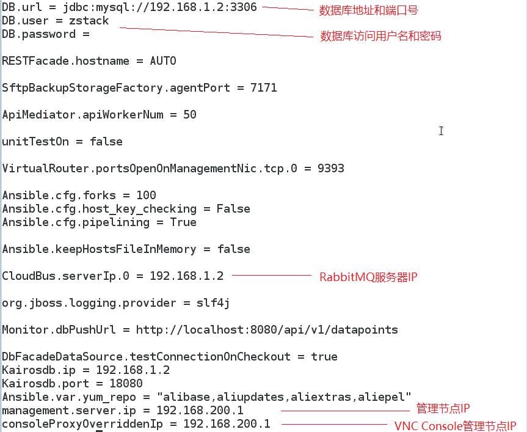

# 23.4 zstack.properties核心配置文件

zstack.properties是系统的核心配置文件。它会存放在每一个管理节点中。 zstack.properties文件中会存放诸如数据库URL，用于数据库访问用户名密码，RabbitmMQ的IP地址等等。 每一个管理节点上的zstack.properties文件的内容基本上是一致的。它的路径可以通过zstack-ctl status来获得。 如果是默认安装的话，它会存放在/usr/local/zstack/apache-tomcat/webapps/zstack/WEB-INF/classes/zstack.properties

zstack.properties文件的示意图如23-4-1所示：

###### 图23-4-1  zstack.properties文件

