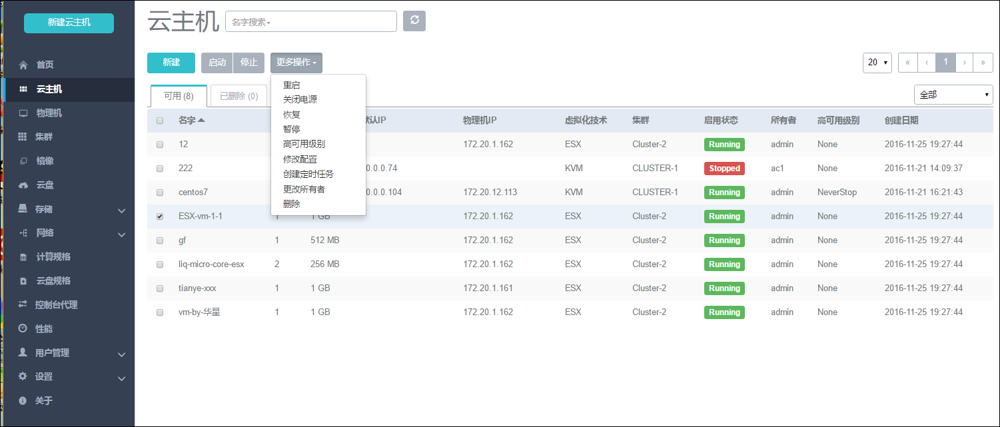

# 10.2 ESX\(i\)云主机操作

添加vCetenr成功后，在云主机界面，会自动显示ESX\(i\)云主机的信息。如图10-2-1所示。

###### 图10-2-1 云主机界面

用户可以点击“新建”按钮，新建所需的ESX\(i\)云主机。这个操作与新建云主机[7.1](/VM/new-vm.md)一样，需要填写云主机名字、选择镜像、计算规格、网络，并支持批量创建。如图10-2-2所示。

**注意:**镜像和网络为vCenter中已有资源，未来会支持创建云主机的更多高级设置。

###### 图10-2-2 新建云主机界面

在云主机列表界面,点击相应云主机的行,可以展开云主机的详细信息并对云主机进行相应的操作,如图10-2-3所示。

根据当前状态的不同,ESX\(i\)云主机的操作可支持启动、停止、重启、关闭电源、打开控制台、设置控制台密码、更改所有者、删除等操作。

###### 图10-2-3 云主机详细信息

对ESX\(i\)云主机操作的定义与kvm云主机相同，具体如下：

1. **启动:**将处于停止状态的云主机启动起来,进入云主机系统;

2. **停止:**将处于运行状态的云主机停止掉,使云主机系统关机;

3. **重启:**将处于运行状态的云主机重启,使云主机系统重新启动;

4. **关闭电源:**当云主机处于运行状态时，使云主机强制进入停止状态。在云主机详情页面，点击操作列表中的关闭电源。正常状态下不建议执行此操作；

5. **暂停（Pause）:**Pause只是让VM暂停，并没有让整个云主机的状态写入硬盘中，因此使用Pause时请不要关闭该云主机所在的物理机。 该操作只对运行中的云主机生效。

6. **恢复：**将处于暂停状态的云主机恢复工作。该操作只对暂停状态的云主机生效。

7. **修改高可用级别:**高可用级别有NeverStop或None两种模式。当高可用模式为NeverStop时，用户停止云主机的操作将会失效。

8. **修改配置：**对已停止的云主机,用户可以点击修改配置来选择其他可用的计算规格,在新弹出的界面选择需更换使用的计算规格来调整云主机使用的CPU、内存或其他资源。

9. **更改所有者:** 将云主机的所有者更改,具体参考[20.4](/User-MN/change-owner.md)更改所有者。

10. **打开控制台：**将进入云主机系统的控制界面,可以登录控制云主机（vnc连接后，CapsLock键不生效）

11. **设置控制台密码：**  
    用户可以添加/删除云主机控制台密码，该密码为VNC协议的密码，而不是云主机本身的密码。设置完成后，重启云主机生效。

12. **添加控制台密码**

###### 图10-2-4 添加控制台密码界面

* 删除控制台密码

###### 图10-2-5 删除控制台密码界面

