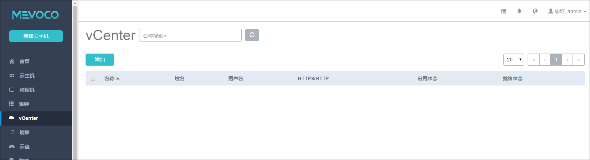
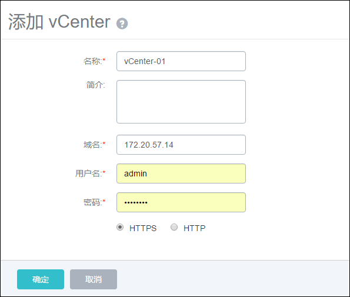
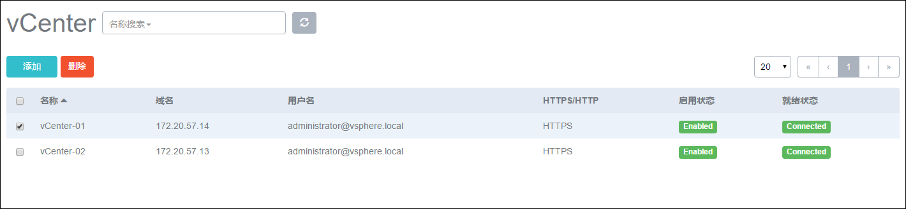
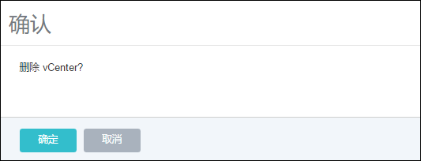
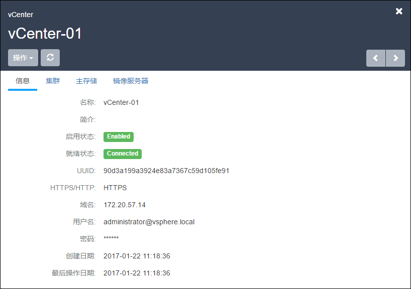
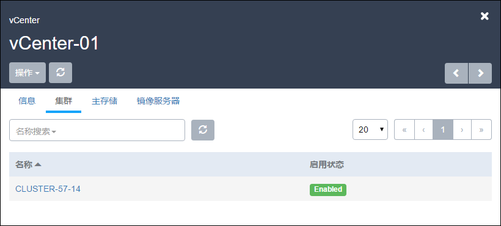
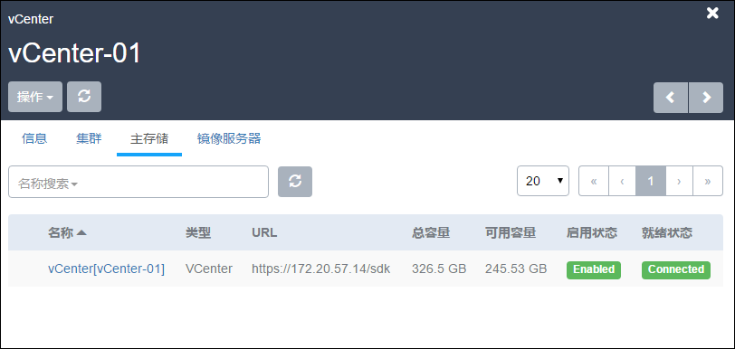
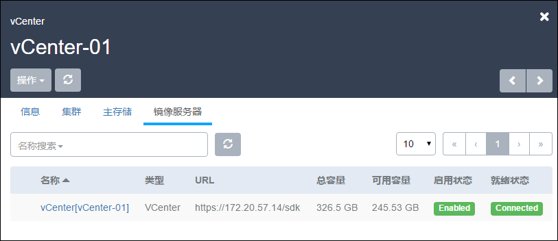

# 10 vCenter操作

点击菜单栏的vCenter按钮，进入vCenter管理界面，如图10-1-1示。支持添加多个vCenter。

###### 图10-1-1 集群界面

### 1.添加vCenter

点击vCenter管理界面的添加vCenter按钮，进入添加vCenter界面。如图10-1-2所示。

###### 图10-1-2 添加vCenter界面

添加vCenter成功后，会自动添加vSphere的集群、物理机、镜像、网络、存储、云主机等资源，在每个资源的界面上都会自动显示。

### 2.删除vCenter

选择一个已添加的Center，点击红色“删除”按钮。如图10-1-3所示。**删除vCenter后会清除其上所有资源在系统中的记录，并不会删除vCenter上的真实资源。**（VMware vSphere Client上登录依然可以看到完整的已部署的VMware环境）

###### 图10-1-3 已添加vCenter

点击“删除vCenter”按钮，弹出确认提示框，点击确定会删除vCener。

###### 图10-1-4 删除vCenter界面

### 3.vCenter详情页

点击vCenter，进入详情页，如图10-1-5所示。在vCenter详细信息中，展示了名称、简介、启用状态、就绪状态、UUID、连接信息等。

###### 图10-1-5 vCenter详细信息

点击详情页的集群、主存储、镜像服务器。可以查看每种资源的状态，并支持停用/启用操作，如下图所示。其他的功能我们会在后续的版本中开放。

###### 图10-1-6 vCenter集群

###### 图10-1-7 vCenter主存储

###### 图10-1-8 vCenter镜像服务器

